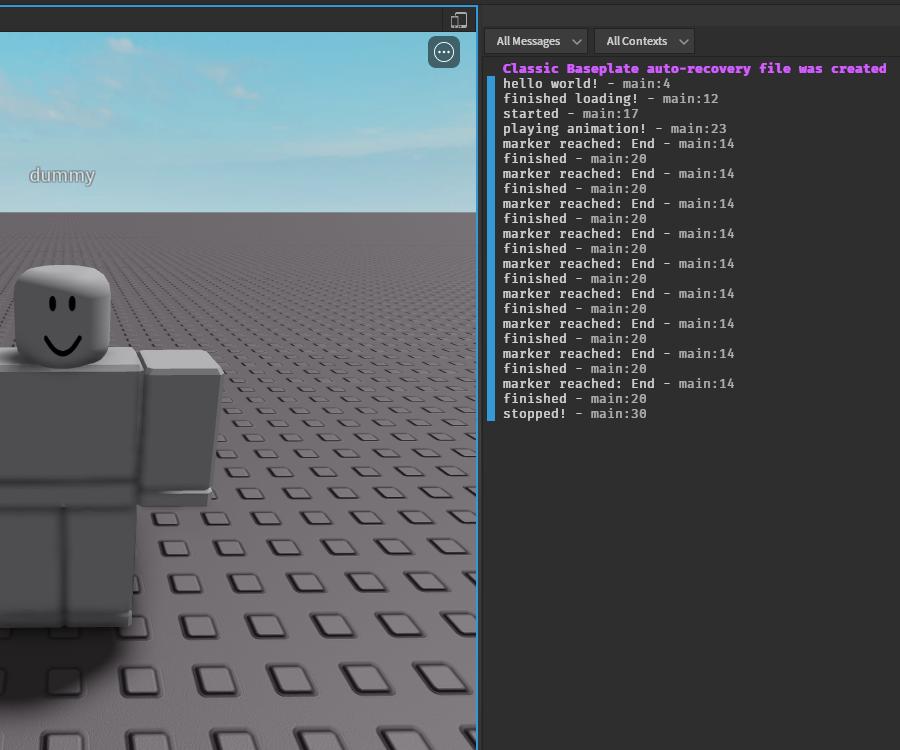

# Getting Started

## How canim works

Canim loads **animations** which are split into tracks and poses. Tracks are regular old animations and poses never move, which makes them useful for static idle animations. <br/>

!!! caution
    ## A note on limitations
    part of Canim's performance is achieved by removing any nesting from the AnimationTracks. This means that rigs with Motor6D's that share the same names will have issues. The default animation plugin
    complains about this but for the default animator there are only certain cases where this would cause issues.

!!! info
    forEach on arrays is used a lot in the documentation because it's quick and convenient, although slow on performance. If you are a Luau user, just use pairs(). It's the same except for the index.


## Before we start...

For all tutorial pages, this script is used with some edits that are specified on each page.
```ts
import { cache_get_keyframe_sequence, Canim, CanimTrack } from "@rbxts/canim";

cache_get_keyframe_sequence("rbxassetid://507766666");

// R15 default dummy
let character = game.GetService("Workspace").WaitForChild("dummy") as Model;
let animator = new Canim();
animator.assign_model(character);

let track = animator.load_animation("main", 1, "rbxassetid://507766666");

animator.play_animation("main");
game.GetService("RunService").RenderStepped.Connect((delta_time) => {
	animator.update(delta_time);
});
```

## Boilerplate

Let's break down this script:
```ts
import { Canim } from "@rbxts/canim";

// R15 default dummy
let character = game.GetService("Workspace").WaitForChild("dummy") as Model;
let animator = new Canim();
animator.assign_model(character);

// loading poses is the same, but only the 1st keyframe is used.
let animation = animator.load_animation("dance", 1, "rbxassetid://507771019");
animation.finished_loading.Wait();

animator.play_animation("dance");
game.GetService("RunService").RenderStepped.Connect((delta_time) => {
	animator.update(delta_time);
});
```

You must assign a character to the animator you create:
```ts
let character = game.GetService("Workspace").WaitForChild("dummy") as Model;
let animator = new Canim();
animator.assign_model(character);
```

Then, you can load your animation:
```ts
// The arguments for the load_animation method are the canim id, priority, and assetid of the animation.
let animation = animator.load_animation("dance", 1, "rbxassetid://507771019");
animation.finished_loading.Wait();

// somewhere else...
if (!animation.loaded) {
    animation.finished_loading.Wait();
}
```

Canim will load an animation called dance. load_animation does not yield; you must wait for the event manually. You can then play the animation with the ID you gave it:
```ts
animator.play_animation("dance");
```

Additionally, you must make sure the animator is updating:
```ts
game.GetService("RunService").RenderStepped.Connect((delta_time) => {
	animator.update(delta_time);
});
```

If you do not want to take care of the event yourself, you can attach it to the animator's maid:
```ts
animator.maid.GiveTask(
	game.GetService("RunService").RenderStepped.Connect((delta_time) => 
		animator.update(delta_time);
	)
);

task.wait(10);

// We no longer need it for one reason or another
animator.destroy();
```

Now, the animation finishes a few times, loops, and then the rig returns to its' default state:

